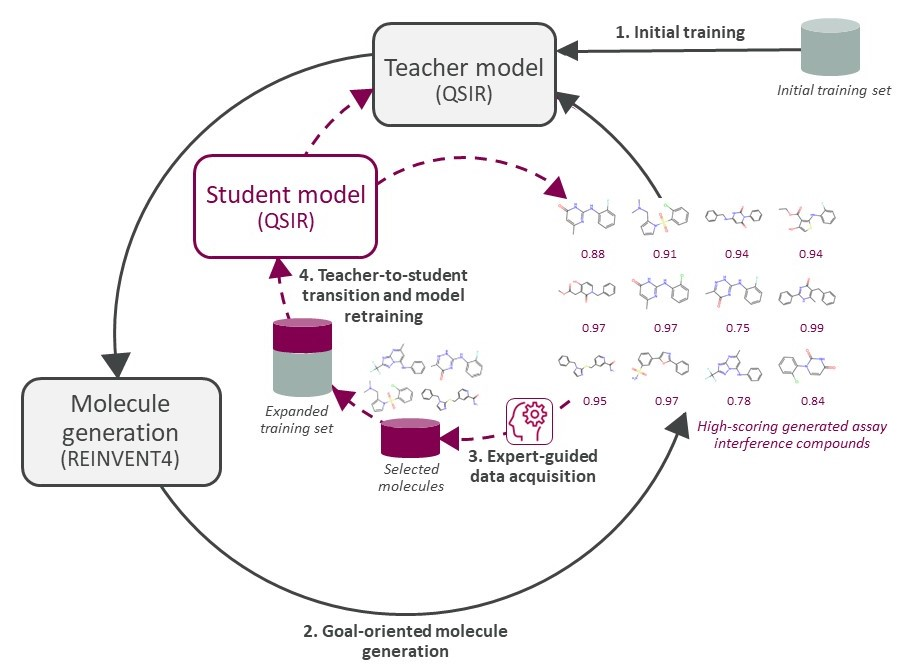

# **E-GuARD**  
### *Expert-Guided Augmentation for Robust Interference Compound Detection*  

[](https://doi.org/10.5281/zenodo.14166168) **THIS NEEDS TO BE CHANGED WITH THIS CODE'S DOI**

---

**⚠️ Requires Python >= 3.10**  
*(Tested on Linux systems)*  

Assay interference by small organic compounds poses significant challenges in early drug discovery. Existing computational methods often fall short due to data scarcity and imbalance, limiting their predictive power. **E-GuARD** introduces a novel framework that combines **self-distillation**, **active learning**, and **generative models** to tackle these challenges effectively and robustly.  

  
*Figure: Overview of E-GuARD. Outer loop (black arrows) for molecule generation and inner loop (dashed red arrows) for iterative updates through self-distillation.*

---

## **Key Features**  
- **Molecular Generation**: Create novel compounds optimized for specific properties.  
- **Self-Distillation**: Boost model performance through iterative training.  
- **Active Learning**: Enhance efficiency by leveraging simulated or expert feedback.  

---

## **Installation**  

1. **Install REINVENT 4**  
   E-GuARD builds on REINVENT 4. Follow its [installation guide](https://github.com/MolecularAI/REINVENT4).  

2. **Create a virtual Python >= 3.10 environment**
   Clone this repository, navigate to its location and install the pip dependencies as follows
   ```bash
   pip install -r requirements.txt
   ```

3. **Install MolSkill**  
   Activate the new environment and install [MolSkill](https://github.com/microsoft/molskill) as follows
   ```bash
   conda install molskill -c msr-ai4science -c conda-forge
   ```

<!---
4. **Activate the REINVENT Environment**  
   Once REINVENT 4 is installed, activate its environment:  
   ```bash
   conda activate reinvent4
   ```  
--->
---

## **Usage**  

### 1. **Train the Teacher Model**  
Train an initial teacher model using one of the provided datasets. For example, to train a model on the **Thiol dataset**:  
```bash
python eGuard/teacher/train.py -d thiol.csv
```  

---

### 2. **Run the E-GuARD Workflow**  
Generate novel molecules and refine models using active learning:  
```bash
python eGuard/run_pipeline/run_pipeline.py \
    -d {dataset}.csv \
    -i {number_of_iterations} \
    -s {acquisition_function}
```  
Replace `{dataset}.csv` with your dataset (e.g., `thiol.csv`), `{number_of_iterations}` with the desired number of iterations, and `{acquisition_function}` with the selected active learning strategy.  

---

## **Data**  
Datasets used for assay interference are sourced from the paper:  
*“Lies and Liabilities: Computational Assessment of High-Throughput Screening Hits to Identify Artifact Compounds”*  
[Read the full article here](https://pubs-acs-org.uaccess.univie.ac.at/doi/full/10.1021/acs.jmedchem.3c00482).  

Available datasets:  
- **FI**: `fluc.csv`  
- **NI**: `nluc.csv`  
- **TR**: `thiol.csv`  
- **RR**: `redox.csv`  

These datasets are located in the `data/` directory.  

---

## **Reproducibility**  
Recreate figures and analysis results using the Jupyter notebooks provided in the `notebooks/` directory.  

---

## **Acknowledgements**  
We express our gratitude to **Roxane Jacob** and **Vincent-Alexander Scholtz** (University of Vienna) for their insightful contributions to the development of machine learning models.  

---

📧 For inquiries, contact **[vincenzo.palmacci@univie.ac.at](mailto:vincenzo.palmacci@univie.ac.at)**  
