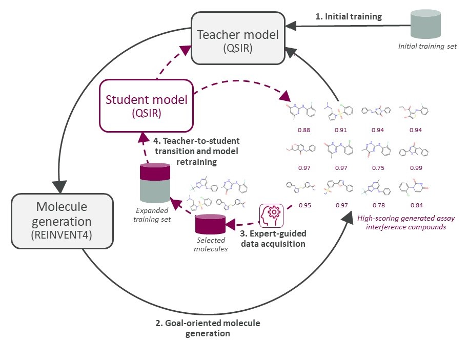

\\

E-GuARD: Expert-Guided Augmentation for Robust Interference Compound Detection
====================================================================================================

Assay interference caused by small organic compounds continues to pose formidable challenges to early drug discovery. Various computational methods have been developed to identify compounds likely to cause assay interference. However, due to the scarcity of data available for model development, the predictive accuracy and applicability of these approaches are limited. In this work, we present E-GuARD (Expert-Guided Augmentation for Robust Interference Compound Detection), a novel framework seeking to address data scarcity and imbalance by integrating self-distillation, active learning, and expert-guided molecular generation.

First, a teacher model is trained, which is used to guide molecule generation towards interfering compounds (outer loop represented by black arrows). Once a pre-defined number of outer loop iterations has been completed, the teacher model becomes the student model and is iteratively updated through expert-guided data augmentation and self-distillation (inner loop represented by dashed red arrows).

# System Requirements

- `python>=3.9`
- This code was tested on Linux

# Installation

1. Since this workflow is based on REINVENT 4, you need a working installation of REINVENT 4. Follow install instructions [here](https://github.com/MolecularAI/REINVENT4).
2. Create a virtual environment with `python>=3.9` and activate it, then install the package with

        pip install E-GuARD

# Usage

Below are command examples to train a target property predictor then running the active learning workflow using a simulated expert to fine-tune it. Make sure to replace the provided paths with yours before running the command lines.
In this example, the target property is DRD2 bioactivity.

**For training the teacher model:**

        python -m hitl_al_gomg.models.train --path_to_train_data data/train/drd2_train --path_to_test_data data/test/drd2_test --path_to_predictor data/predictors/drd2 --path_to_simulator data/simulators/drd2 --train True --demo True

- To use the same DRD2 bioactivity simulator than that of the paper, you can download `drd2.pkl` from this [URL](https://huggingface.co/yasminenahal/hitl-al-gomg-simulators/tree/main).
- The directory `example_files/` contains examples of hyperparameter grids to run cross-validation for `scikit-learn` Random Forest models. If you wish to enable hyparameter search, you can specify your grid file via ``--path_to_param_grid`` (e.g. ``--path_to_param_grid example_files/rfc_param_grid.json``).

**For running the E-GuARD workflow:**

Once you have a pre-trained predictor for your target property, you can use it to run REINVENT to produce novel molecules that satisfy this property.

- First, you need to run the workflow without active learning so that you can generate the set of generated molecules based on your initial target property predictor.

        python -m hitl_al_gomg.run --seed 3 --rounds 4 --num_opt_steps 100 --path_to_output_dir results --path_to_reinvent_env /home/miniconda3/envs/reinvent-hitl --path_to_reinvent_repo /home/Test_my_code/Reinvent --task drd2 --path_to_scoring_model data/predictors/drd2 --path_to_simulator data/simulators/drd2 --model_type classification --scoring_component_name bioactivity --dirname demo_drd2 --path_to_train_data data/train/drd2_train --acquisition None

- Then, you can run the workflow using active learning. Below is an example where we use entropy-based sampling to select `10` query molecules to be evaluated by the simulated expert model.

        python -m hitl_al_gomg.run --seed 3 --rounds 4 --num_opt_steps 100 --path_to_output_dir results --path_to_reinvent_env /home/miniconda3/envs/reinvent-hitl --path_to_reinvent_repo /home/Test_my_code/Reinvent --task drd2 --path_to_scoring_model data/predictors/drd2 --path_to_simulator data/simulators/drd2 --model_type classification --scoring_component_name bioactivity --dirname demo_drd2 --path_to_train_data data/train/drd2_train --acquisition entropy --al_iterations 5 --n_queries 10 --noise 0.1

# Data

We provide the four assay interference data sets for training the penalized LogP and DRD2 bioactivity predictors, as well as a sample from ChEMBL on which `REINVENT` prior agent was pre-trained.
  
# Notebooks

In `notebooks/`, we provide Jupyter notebooks with code to reproduce the paper's result figures.

# Acknowledgements

We thank Roxane Jacob and Vincent-Alexander Scholtz from the University of Vienna, for their insightful discussions regarding the development of machine learning models.

**For any inquiries, please contact johannes.kirchmair@univie.ac.at**
